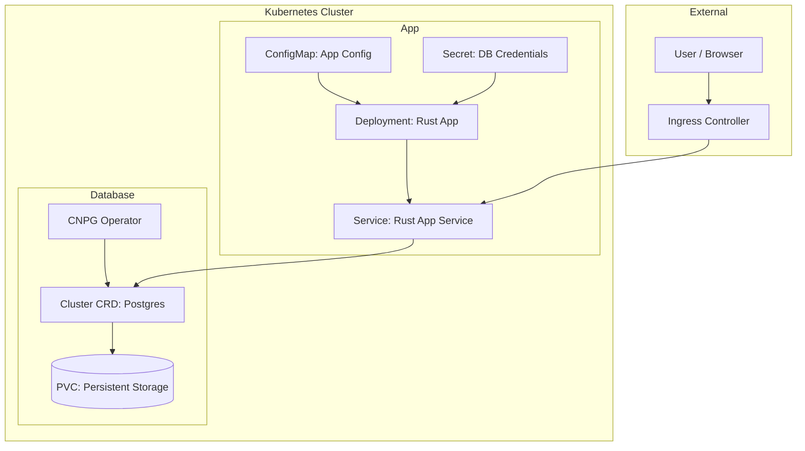

# Structure of Project Deployment

```mermaid
flowchart TD
    subgraph Kubernetes Cluster
        subgraph App
            A[Deployment: Rust App]
            B[Service: Rust App Service]
            A --> B
            C[ConfigMap: App Config]
            D[Secret: DB Credentials]
            C --> A
            D --> A
        end

        subgraph Database
            E[CNPG Operator]
            F[Cluster CRD: Postgres]
            G[(PVC: Persistent Storage)]
            F --> G
            E --> F
        end

        B --> F
    end

    subgraph External
        H[User / Browser]
        I[Ingress Controller]
        H --> I --> B
    end
```
