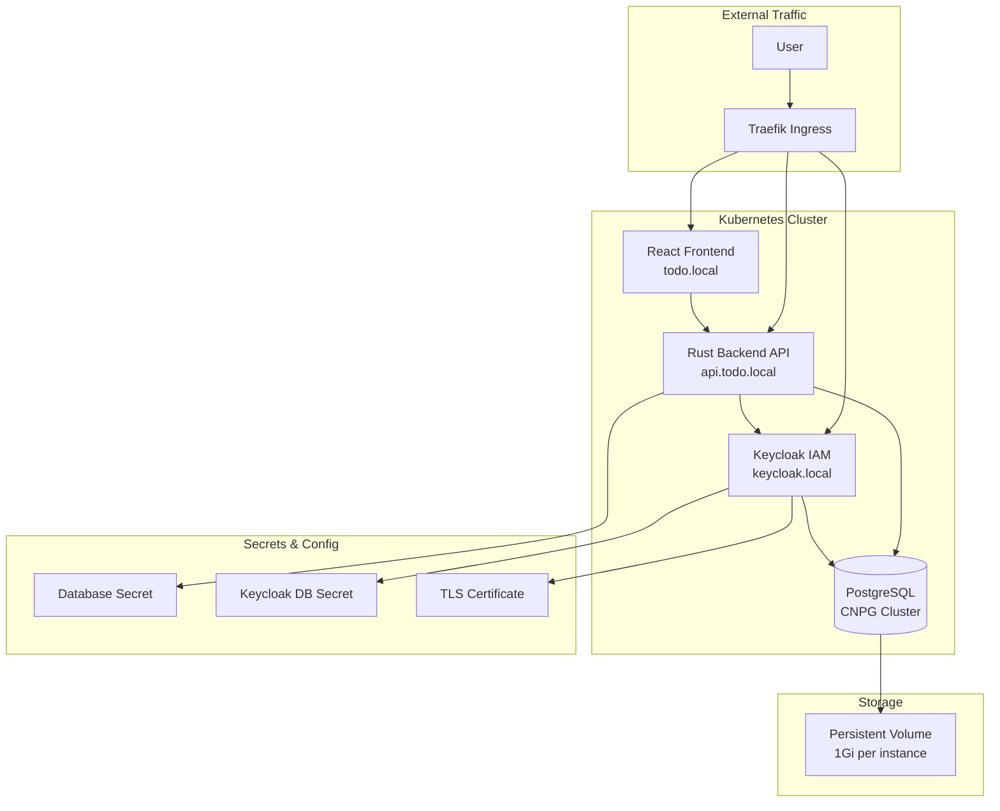
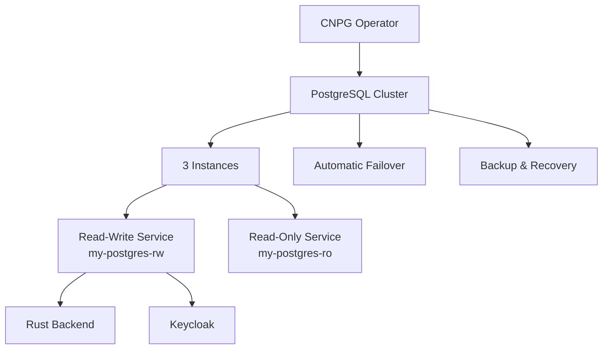
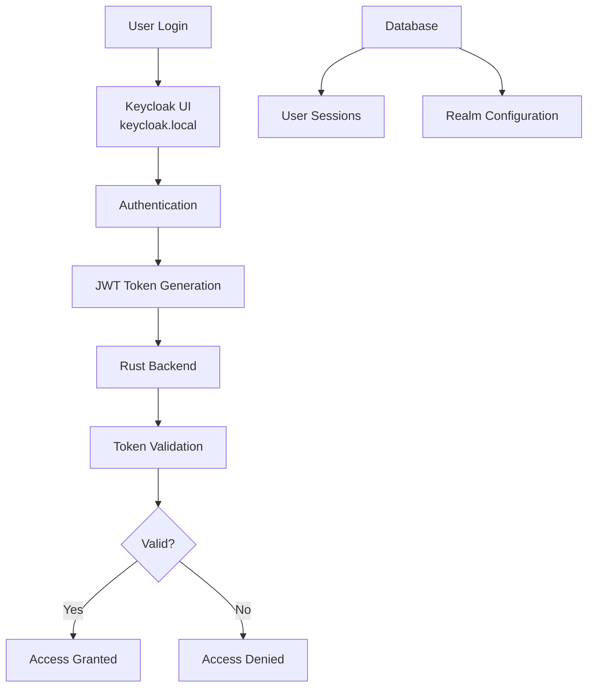
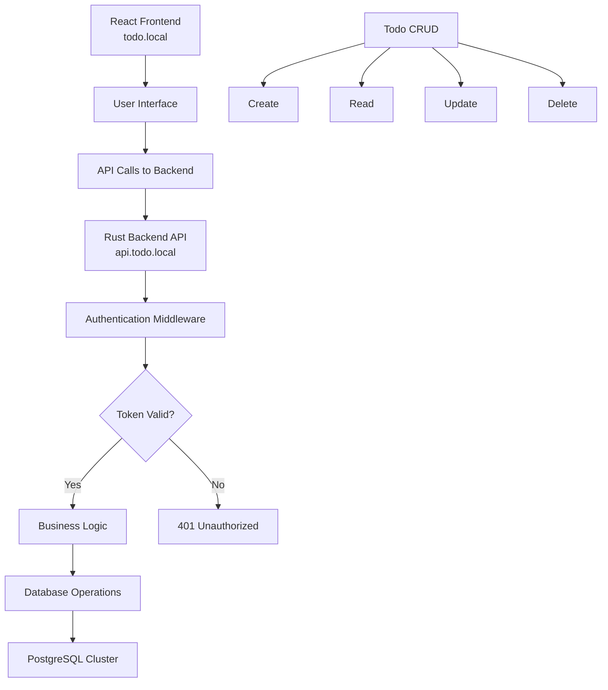
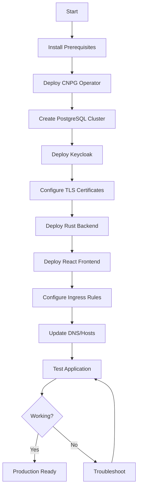
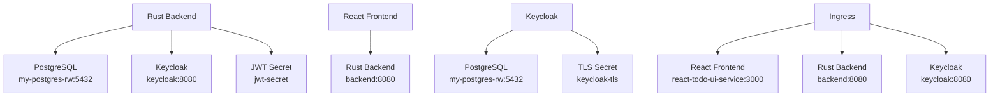
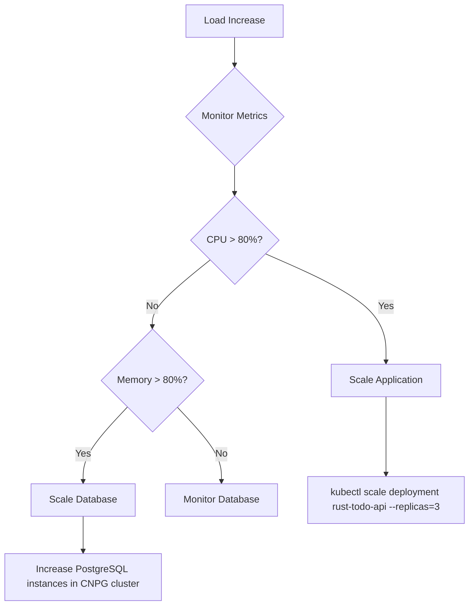
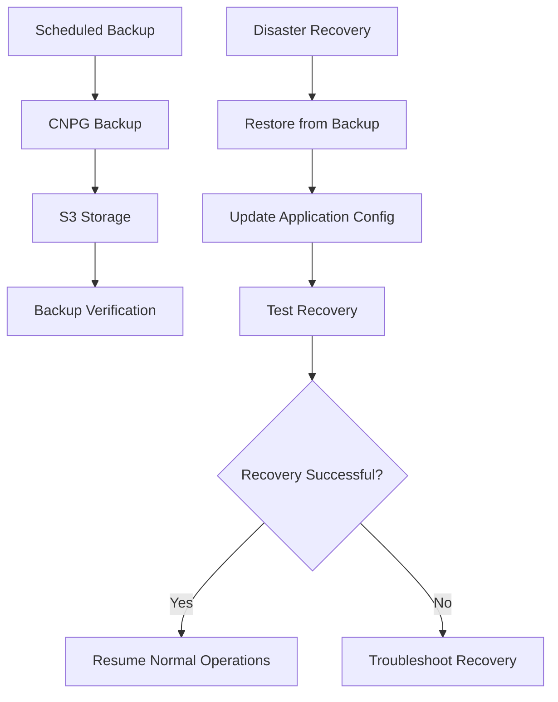

# Kubernetes Setup Workflow and Architecture

This document provides a comprehensive overview of the Kubernetes deployment setup for the Rust Todo application with Keycloak authentication and PostgreSQL database.

## Architecture Overview



## Component Details

### 1. Database Layer (CNPG)



**Key Features:**
- **High Availability**: 3 PostgreSQL instances with automatic failover
- **Storage**: 1Gi persistent volume per instance
- **Backup**: Automated backup capabilities through CNPG
- **Scaling**: Horizontal scaling support

### 2. Authentication Layer (Keycloak)



**Key Features:**
- **Production Mode**: HTTPS enabled with TLS certificates
- **Database Integration**: Stores user data in PostgreSQL
- **JWT Tokens**: Issues and validates JSON Web Tokens
- **Realm Management**: Configurable authentication realms

### 3. Application Layer



## Deployment Workflow



## Detailed Deployment Steps

### Step 1: Prerequisites
```bash
# Install kubectl and helm
# Ensure Kubernetes cluster is running
# Install Traefik ingress controller
kubectl apply -f https://raw.githubusercontent.com/traefik/traefik/v2.5/docs/content/reference/dynamic-configuration/kubernetes-crd-definition-v1.yml
kubectl apply -f https://raw.githubusercontent.com/traefik/traefik/v2.5/docs/content/reference/dynamic-configuration/kubernetes-crd-rbac.yml
kubectl apply -f https://raw.githubusercontent.com/traefik/traefik/v2.5/docs/content/reference/dynamic-configuration/kubernetes-crd.yml
```

### Step 2: Database Setup
```bash
# Deploy CNPG operator
kubectl apply -f k8s_setup/database/cnpg-operator.yaml

# Create PostgreSQL cluster
kubectl apply -f k8s_setup/database/cnpg.yaml

# Wait for cluster to be ready
kubectl wait --for=condition=ready pod -l postgresql.cnpg.io/cluster=my-postgres --timeout=300s
```

### Step 3: Keycloak Setup
```bash
# Generate TLS certificates
openssl req -x509 -newkey rsa:4096 -keyout k8s_setup/certificates/tls.key -out k8s_setup/certificates/tls.crt -days 365 -nodes -subj "/CN=keycloak.local"

# Create TLS secret
kubectl create secret tls keycloak-tls --cert=k8s_setup/certificates/tls.crt --key=k8s_setup/certificates/tls.key

# Deploy Keycloak components
kubectl apply -f k8s_setup/keycloak/

# Wait for Keycloak to be ready
kubectl wait --for=condition=available --timeout=300s deployment/keycloak
```

### Step 4: Application Deployment
```bash
# Deploy Rust backend
kubectl apply -f k8s_setup/rust-todo/rust-backend-deployment.yaml

# Deploy React frontend
kubectl apply -f k8s_setup/rust-todo/react-frontend-deployment.yaml

# Configure ingress
kubectl apply -f k8s_setup/rust-todo/todo-ingress.yaml
```

### Step 5: DNS Configuration
```bash
# Update /etc/hosts file
echo "192.168.82.89 keycloak.local todo.local api.todo.local" | sudo tee -a /etc/hosts
```

## Service Dependencies



## Monitoring and Troubleshooting

### Health Checks
```bash
# Check pod status
kubectl get pods

# Check services
kubectl get services

# Check ingress
kubectl get ingress

# View logs
kubectl logs -f deployment/rust-todo-api
kubectl logs -f deployment/keycloak
```

### Common Issues

1. **Certificate Errors**: Ensure TLS secret is properly created
2. **Database Connection**: Verify PostgreSQL cluster is running
3. **Ingress Not Working**: Check Traefik ingress controller
4. **Keycloak Login Issues**: Verify HTTPS configuration

### Scaling Considerations



## Security Considerations

- **TLS Everywhere**: All services use HTTPS in production
- **Secret Management**: Database credentials stored in Kubernetes secrets
- **Network Policies**: Consider implementing network segmentation
- **RBAC**: Keycloak provides fine-grained access control
- **Audit Logging**: Enable audit logs for compliance

## Backup and Recovery



This comprehensive setup provides a production-ready, scalable, and secure deployment of the Rust Todo application with Keycloak authentication and PostgreSQL database management.
